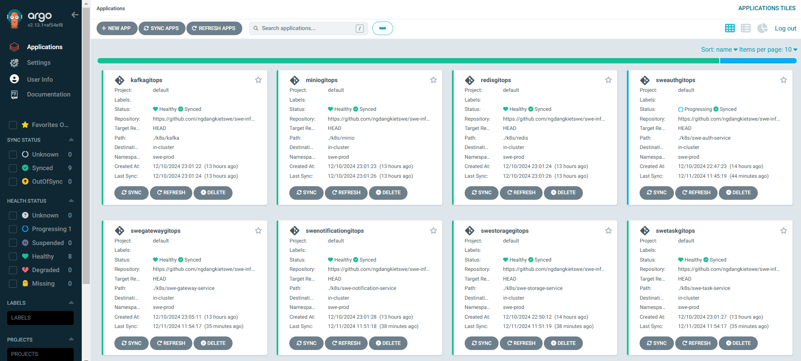

# SWE ArgoCD

This repository contains the ArgoCD setup for the SWE project.

## Setup

1. Install ArgoCD following the instructions in
   the [swe-infrastructure](https://github.com/ngdangkietswe/swe-infrastructure) repository.
2. Create applications in ArgoCD:

    ```bash
    make apply-all
    ```
3. Wait for the applications to be synced.
4. Result:

   